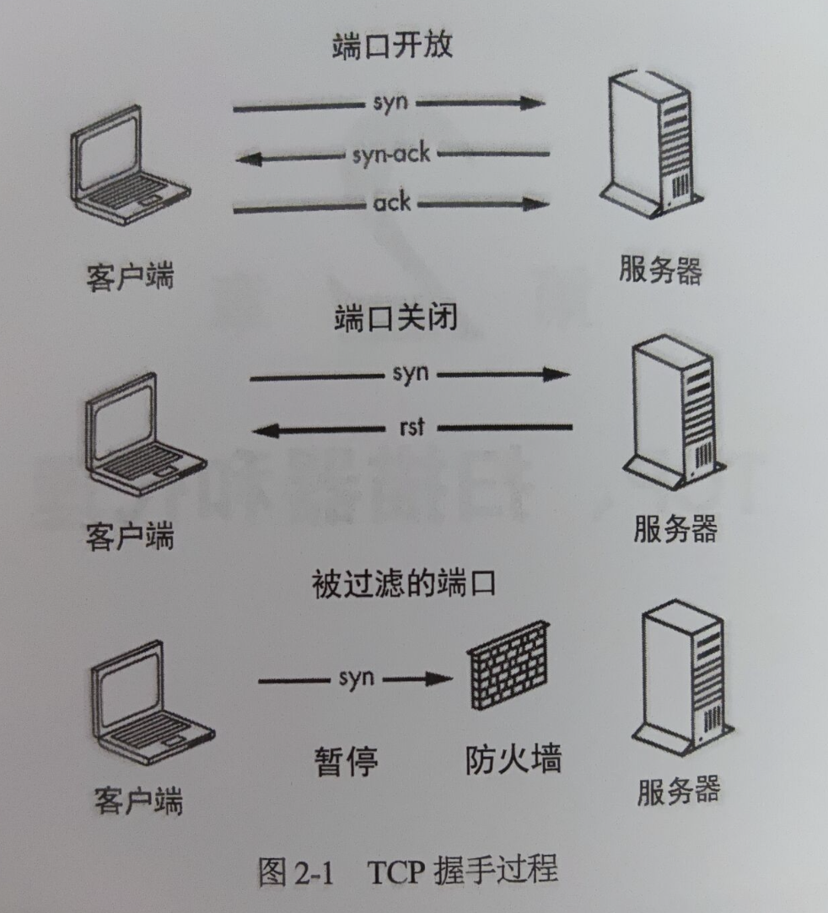

## tcp端口扫描demo实现

### tcp握手机制


如果端口是开放的，则会进行三次握手。客户端发送一个syn数据包，该数据包表示通信开始，然后服务器以syn-ack进行响应，客户端提示ack作为结束。之后就可以进行数据传输。

如果端口关闭，服务器则会响应一个rst数据包。

如果流量被防火墙过滤，客户端通常不会从服务器接收到任何响应。

### 测试端口可用性

探测端口是否开放，我们可以使用net包的`net.Dial(network, address string)`

第一个参数是一个字符串，用于标识要启动的连接的类型。Dial不仅适用tcp，还可以用于创建适用uninx套接字，udp和第四层协议的连接

第二个参数告诉Dial你想要连接的主机。

现在已经知道如何创建连接，如何才能知道连接成功呢？可以通过执行错误检查来判断

````go
package main

import (
	"fmt"
	"net"
)

func main(){
	_,err :=net.Dial("tcp","scanme.nmap.org:80")
	if err ==nil{
		fmt.Println("connection successful")
	}
}
````
如果端口开放error将为nil

### 使用多通道

```go
package main

import (
	"fmt"
	"net"
	"sort"
)

func worker(ports , results chan int)  {
	for p:=range ports{
		address :=fmt.Sprintf("scanme.nmap.org:%d",p)
		conn ,err :=net.Dial("tcp",address)
		if err !=nil{
			results <-0
			continue
		}
		conn.Close()
		// 将开放端口发送给results通道
		results<-p
	}
}

func main()  {
	ports :=make(chan int,100)
	results :=make(chan int)
	var openports []int
	/*
	同时启动100个线程进行扫描
	*/
	for i:=0;i<cap(ports);i++{
		go worker(ports,results)
	}

	/*
	采用channel来传输端口
	所有goroutine同时从ports获取扫描资源。保证了在并发扫描时不会重复扫描同一个端口
	*/
	go func() {
		for i:=1;i<=1024;i++{
			ports <-i
		}
	}()

	for i:=0;i<1024;i++{
	//将接受的结果添加到openports切片
		port :=<-results
		if port!=0{
			openports=append(openports,port)
		}
	}

	close(ports)
	close(results)
	sort.Ints(openports)
	for _,port :=range openports{
		fmt.Printf("%d open\n",port)
	}

}
```


